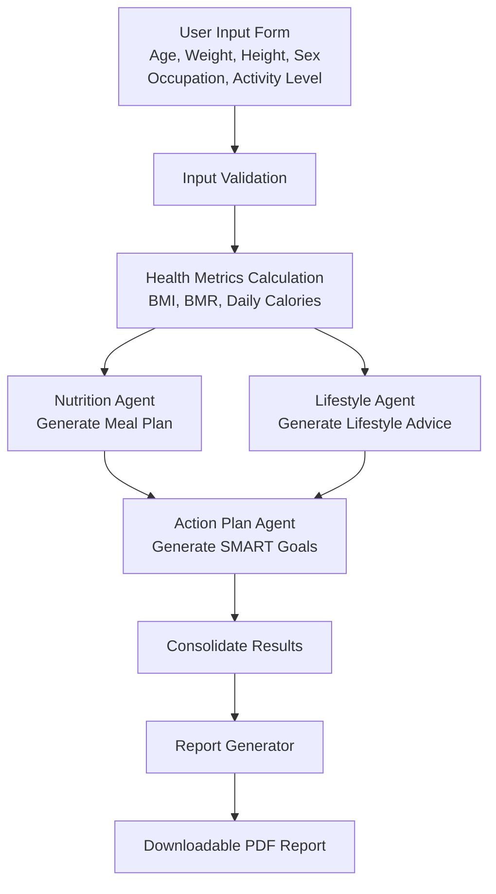

# MyBody, MyPlan: Personalized Wellness AI

This project is a **Streamlit-based web app** that uses Google ADK (Gemini 3.1 Flash Lite) and multiple AI agents to generate **personalized nutrition, lifestyle, and action plans**, including PDF reports.

---

## Functional Diagrams

### 1️⃣ Functional Diagram 

---

### 2️⃣ System Architecture Diagram 

---
config:
  layout: fixed
---
flowchart TB
 subgraph NutritionAgentWorkflow["Nutrition Agent Workflow"]
    direction TB
        D2["Armour Safety Check: check_safe_prompt()"]
        D1["Compose Nutrition Prompt with metrics"]
        D3["Call API to generate meal plan JSON"]
        D7["Return Fallback Meal Plan JSON"]
        D4["Parse JSON output"]
        D5["Fetch detailed nutrition from OpenFoodFacts API"]
        D6["Return nutrition JSON"]
  end
 subgraph LifestyleAgentWorkflow["Lifestyle Agent Workflow"]
    direction TB
        E2["Generate personalized lifestyle suggestions"]
        E1["Analyze activity, occupation, lifestyle habits"]
        E3["Return lifestyle plan JSON"]
  end
 subgraph ActionPlanAgentWorkflow["Action Plan Agent Workflow"]
    direction TB
        F2["Armour Safety Check: check_safe_prompt()"]
        F1["Compose Action Plan Prompt with Nutrition + Lifestyle JSON"]
        F3["Call API to generate SMART Objectives JSON"]
        F7["Return Fallback SMART Goals JSON"]
        F4["Parse JSON output for SMART Goals"]
        F5["Return consolidated Action Plan JSON"]
  end
    A["User Input Form: Age, Weight, Height, Sex, Occupation, Activity Level"] -- Raw user input --> B["Input Validation Function"]
    B -- Validated Metrics JSON --> C["Metrics Function (health_tools)"]
    C L_C_NutritionAgentWorkflow_0@--> NutritionAgentWorkflow & LifestyleAgentWorkflow
    D1 --> D2
    D2 -- Safe --> D3
    D2 -- Unsafe --> D7
    D3 --> D4
    D4 --> D5
    D5 --> D6
    D7 --> D6
    E1 --> E2
    E2 --> E3
    F1 --> F2
    F2 -- Safe --> F3
    F2 -- Unsafe --> F7
    F3 --> F4
    F4 --> F5
    F7 --> F5
    F5 -- Consolidated Action Plan JSON --> G["Report Generator Function (local)"]
    G -- PDF Report --> H["PDF Report with Nutrition + Lifestyle + SMART Objectives"]
    H -- Downloadable PDF --> I["User Downloads PDF"]
    F["Action Plan Agent Workflow"] --> ActionPlanAgentWorkflow
    LifestyleAgentWorkflow --> F
    NutritionAgentWorkflow --> F

     D2:::localFunc
     D5:::localFunc
     F2:::localFunc
     B:::localFunc
     C:::localFunc
     G:::localFunc
    classDef localFunc fill:#FFECB3,stroke:#FF6F00,stroke-width:2px,color:#000000

    L_C_NutritionAgentWorkflow_0@{ curve: linear }