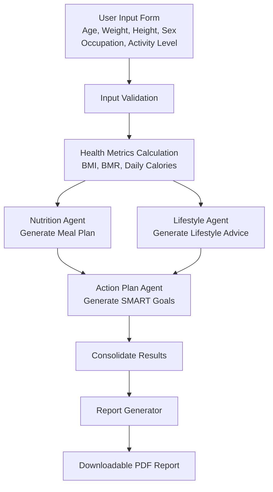
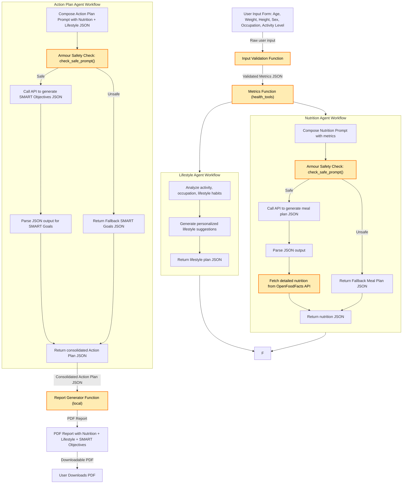

# MyBody, MyPlan: Personalized Wellness AI

Gemini Nexus: The Agentverse – Build with AI Hackathon Submission
Track C: The Operations Hub (Process Automation Swarm)

This project provides a personalized health & wellness plan generator using Streamlit and Gemini/ADK APIs. You can run it locally for testing or deploy it to Google Cloud Run for production. 
This project is a **Streamlit-based web app** that uses Google ADK and multiple AI agents to generate **personalized nutrition, lifestyle, and action plans**, including PDF reports.

Deployment link on Google Cloud: https://mybodyplan-1034997483221.us-central1.run.app/
Voice over Demo link on Youtube: https://www.youtube.com/watch?v=Njd9PZFR8gE

📌 Tech Stack
| Component                       | Technology / Tool                                             |
| ------------------------------- | ------------------------------------------------------------- |
| Frontend / UI                   | Streamlit                                                     |
| Backend / Server                | Python (Flask optional for API endpoints)                     |
| Model Integration               | Gemini / ADK                                                  |
| Containerization                | Docker                                                        |
| Cloud Deployment                | Google Cloud Run                                              |
| Build Automation                | Google Cloud Build                                            |
| Environment Variables / Secrets | Google Cloud Secret Manager / Cloud Run environment variables |
| Local Development               | Python 3.10+, Google Cloud CLI, Virtual Environment           |
| Dependencies Management         | `requirements.txt`                                            |

## Functional Diagrams

---

### System Architecture Diagram 

---

# ⚙️ Local Deployment (Testing)

Required if you want to test Model Armor / Gemini API locally.

# 1. Install Google Cloud CLI

Download and install the official Google Cloud SDK (CLI) for your OS:

https://cloud.google.com/sdk/docs/install

After installation, initialize it:

<pre>gcloud init</pre>

Log in with your Google account

Select your project

Set default region (e.g., us-central1)

# 2. Clone the repository
<pre>git clone https://github.com/Cammy276/MyBody_MyPlan_Personalized-Wellness-AI.git
cd MyBody_MyPlan_Personalized-Wellness-AI</pre>

# 3. Create a virtual environment
<pre>python -m venv .venv</pre>

# Linux / Mac
<pre>source .venv/bin/activate</pre>

# Windows
<pre>.venv\Scripts\activate</pre>

# 4. Install dependencies
<pre>pip install --upgrade pip
pip install -r requirements.txt</pre>

# 5. Set Environment Variables

Create a .env file in the project root:

<pre>GOOGLE_CLOUD_PROJECT="YOUR_PROJECT_ID"
GOOGLE_CLOUD_LOCATION="us-central1"
GOOGLE_API_KEY="YOUR_GOOGLE_API_KEY"
MODEL_ARMOR_TEMPLATE_ID="YOUR_TEMPLATE_ID"</pre>

Or export them in the terminal:

<pre>export GOOGLE_CLOUD_PROJECT="YOUR_PROJECT_ID"
export GOOGLE_CLOUD_LOCATION="us-central1"
export GOOGLE_API_KEY="YOUR_GOOGLE_API_KEY"
export MODEL_ARMOR_TEMPLATE_ID="YOUR_TEMPLATE_ID"</pre>

# 6. Run the app locally
<pre>streamlit run app/main.py</pre>

Open your browser at http://localhost:8501

Input age, weight, height, occupation, and activity level

Generate your health plan and PDF

Note: Local requests to Gemini/ADK may take 5–15 seconds per request.

🐳 Docker Deployment
# 1. Create Dockerfile in project root
<pre># Use official Python image
FROM python:3.11-slim

# Set working directory
WORKDIR /app

# Copy requirements and install all dependencies
COPY requirements.txt .
RUN pip install --no-cache-dir -r requirements.txt

# Copy the entire project
COPY . .

# Expose Streamlit port
EXPOSE 8080

# Run Streamlit
CMD streamlit run app/main.py --server.port 8080 --server.address 0.0.0.0 --browser.serverAddress=0.0.0.0
</pre>

# 2. Create .dockerignore
<pre>
 __pycache__/
*.pyc
.env
*.git
.venv/
node_modules/
</pre>

Reduces Docker image size dramatically (~3.5GB → <100MB).

# 3. Build Docker image locally (optional)
<pre>docker build -t mybodyplan .
docker run -p 8080:8080 mybodyplan</pre>

# ☁️ Google Cloud Deployment (Cloud Run)
# 1. Initialize Google Cloud Project

Go to Google Cloud Console

Create a new project (e.g., mybodyplan)

Note the Project ID

# 2. Enable required services
<pre>gcloud services enable run.googleapis.com
gcloud services enable cloudbuild.googleapis.com</pre>

# 3. Set project and region
<pre>
gcloud config set project YOUR_PROJECT_ID
gcloud config set run/region us-central1
</pre>

# 4. Clone your repo in Cloud Shell
</pre>git clone https://github.com/Cammy276/MyBody_MyPlan_Personalized-Wellness-AI.git
cd MyBody_MyPlan_Personalized-Wellness-AI
</pre>

# 5. Build the container image
<pre>gcloud builds submit --tag gcr.io/YOUR_PROJECT_ID/mybodyplan .</pre>

# 6. Deploy to Cloud Run
<pre> run deploy mybodyplan \
  --image gcr.io/YOUR_PROJECT_ID/mybodyplan \
  --platform managed \
  --allow-unauthenticated</pre>

Cloud Run will provide a public URL:
https://mybodyplan-123456789012.us-central1.run.app

# 7. Set Environment Variables on Cloud Run
<pre>gcloud run services update mybodyplan \
    --update-env-vars \
GOOGLE_CLOUD_PROJECT="YOUR_PROJECT_ID",\
GOOGLE_CLOUD_LOCATION="us-central1",\
GOOGLE_API_KEY="YOUR_GOOGLE_API_KEY",\
MODEL_ARMOR_TEMPLATE_ID="YOUR_TEMPLATE_ID"</pre>

The app can now access these variables via os.getenv().

# 8. Test Your App

Open the Cloud Run URL

Input user metrics: age, weight, height, occupation, activity level

Generate health plan and PDF

Each Gemini/ADK request may take 5–15 seconds.
